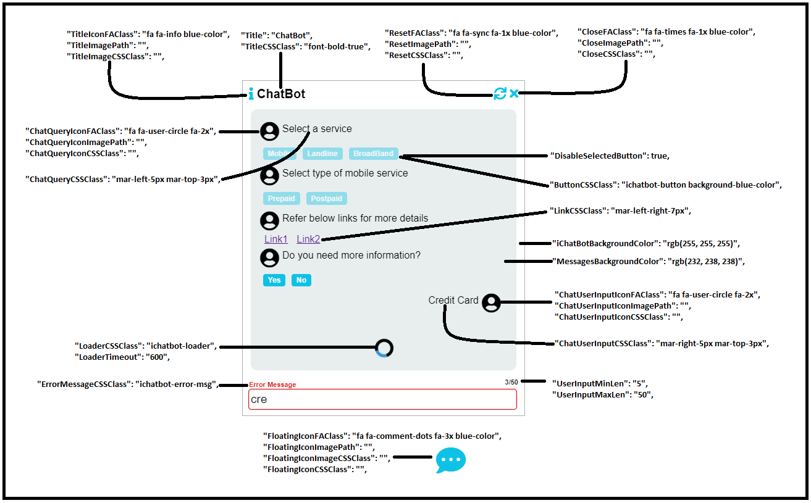

## **iChatBot**

  

---

### **Example Workflows**

<big><pre>
[https://github.com/user/repo/blob/branch/other_file.md](https://kishoreithadi.github.io/iChatbot/)
</pre></big>

---

### **Table of Contents**
* [What is **iChatBot**?](#what-is-ichatbot)
* [Installation](#Installation)
    * [1. NPM-Angular](#1-NPM-Angular)
    * [2. HTML](#2-HTML)
* [iChatbotConfig.js](#ichatbotconfigjs)
* [Dataset](#dataset)
* [Workflows](#Add-Remove-Project-Reference)
    * [Simple Workflow](#Add-Remove-DLL-Reference)
    * [Complex Workflow](#Add/Remove-Nuget-packages)
    * [File Upload Workflow](#Publish-Project)
* [License](#license)

---

### **What is iChatBot?**

iChatBot is a fully customizable javascript library that enables you to create a chatbot with various workflows in a very short time.

---

### **Installation**

#### **1. NPM Angular**

```bash
npm install --save ichatbot
```

Add styles and scripts in **angular.json** 

```json
"styles": [
  "node_modules/iChatBot/iChatBot-1.0.0.min.css"
],
"scripts": [
  "node_modules/iChatBot/iChatBot-1.0.0.js",
  "src/iChatBotConfig.js"
]
```

Add below link for getting default **font-awesome icons**, later you can remove/updated based on requirement

```html
<link rel="stylesheet" href="https://cdnjs.cloudflare.com/ajax/libs/font-awesome/5.15.1/css/all.min.css">
```

Add below tag anywhere in **html** file

```html
<div id="ichatbot-div"></div>
```

In your component

```javascript
import { Component } from '@angular/core';

declare var iChatBot: any;
declare var iChatBotConfig: any;

@Component({
  selector: 'app-root',
  templateUrl: './app.component.html',
  styleUrls: ['./app.component.css']
})
export class AppComponent {
  title = 'my-app';

  ngOnInit() {

    var iChatBotDataset =
    {
      "Queries":
        [
          {
            "ID": "1",
            "Query": "Welcome to chatbot",
            "Options": "101",
            "Type": "Link",
            "QueryID": "",
            "SearchInQueries": false,
            "SearchKeywords": "",
            "FireSubscribedEvent": false,
            "Validation": "",
            "ValidationErrorMsg": ""
          }
        ],
      "Options":
        [
          {
            "ID": "101",
            "Text": "Documentation",
            "Type": "Link",
            "URL": "https://github.com/KishoreIthadi/iChatbot",
            "Query": "",
            "FireSubscribedEvent": false
          }
        ]
    }

    iChatBot.Initialize(iChatBotConfig, iChatBotDataset);

    //Subscribing to UserInput Entered, User Button Click, Chat Reset, Chat Close events
    var userTextEvent = function UserText(chatSession: any) {
      console.log('ichatbot : user text input event fired')
      console.log(chatSession);
    }

    var buttonClickEvent = function ButtonClick(chatSession: any) {
      console.log('ichatbot : user button click event fired')
      console.log(chatSession);
    }

    var resetEvent = function Reset(chatSession: any) {
      console.log('ichatbot : chat reset event fired')
      console.log(chatSession);
    }

    var closeEvent = function Close(chatSession: any) {
      console.log('ichatbot : chat close event fired')
      console.log(chatSession);
    }

    var fileUploadEvent = function FileUpload(files: any, chatSession: any) {
      console.log('ichatbot : file upload event fired')
      console.log(files);
      console.log(chatSession);

      iChatBot.SimpleQuery("<b>File Uploaded Sucessfully</b>")
      iChatBot.LoadQuery(5);

      console.log(iChatBot.GetChatSession());
    }

    iChatBot.SubscribeEvent(userTextEvent, buttonClickEvent, resetEvent, closeEvent, fileUploadEvent);

    // iChatBot.ShowLoader(5000);
    // iChatBot.HideLoader();

    // iChatBot.OpenChatBot();
    // iChatBot.CloseChatBot();

    // iChatBot.ShowErrorMsg("Error Message");
    // iChatBot.GetChatSession();
  }
}

```
---

#### **2. HTML**

Download iChatBot.js, iChatBotConfig.js & iChatBotStyle.css from below link and add it to your project.

```link
https://cdnjs.cloudflare.com/ajax/libs/font-awesome/5.15.1/css/all.min.css
```

Add link and script in head section
```html
<head>
    <!-- Font-Awesome is for appying default icons, please update as per your requirement -->
    <link rel="stylesheet" href="https://cdnjs.cloudflare.com/ajax/libs/font-awesome/5.15.1/css/all.min.css">

    <link rel="stylesheet" href="iChatBotStyle.css">

    <script src="iChatBot.js"></script>
    <script src="iChatBotConfig.js"></script>
</head>
```

Add below in body section
```html
<body>
    <div id="ichatbot-div">
    </div>

    <script>
        var iChatBotDataset =
        {
            "Queries":
                [
                    {
                        "ID": "1",
                        "Query": "Welcome to chatbot",
                        "Options": "101",
                        "Type": "Link",
                        "QueryID": "",
                        "SearchInQueries": false,
                        "SearchKeywords": "",
                        "FireSubscribedEvent": false,
                        "Validation": "",
                        "ValidationErrorMsg": ""
                    }
                ],
            "Options":
                [
                    {
                        "ID": "101",
                        "Text": "Documentation",
                        "Type": "Link",
                        "URL": "https://github.com/KishoreIthadi/iChatbot#readme",
                        "Query": "",
                        "FireSubscribedEvent": false
                    }
                ]
        }
        // iChatBotConfig is loaded from iChatBotConfig.js
        iChatBot.Initialize(iChatBotConfig, iChatBotDataset, null);

        //Subscribing to events
        var userTextEvent = function UserText(chatSession) {
            console.log('ichatbot : user text input event fired')
            console.log(chatSession);
        }

        var buttonClickEvent = function ButtonClick(chatSession) {
            console.log('ichatbot : user button click event fired')
            console.log(chatSession);
        }

        var resetEvent = function Reset(chatSession) {
            console.log('ichatbot : chat reset event fired')
            console.log(chatSession);
        }

        var closeEvent = function Close(chatSession) {
            console.log('ichatbot : chat close event fired')
            console.log(chatSession);
        }

        var fileUploadEvent = function FileUpload(files, chatSession) {
            console.log('ichatbot : file upload event fired')
            console.log(files);
            console.log(chatSession);

            iChatBot.SimpleQuery("<b>File Uploaded Sucessfully</b>")
            iChatBot.LoadQuery(5);

            console.log(iChatBot.GetChatSession());
        }

        iChatBot.SubscribeEvent(userTextEvent, buttonClickEvent, resetEvent, closeEvent, fileUploadEvent);

        // iChatBot.ShowLoader(5000);
        // iChatBot.HideLoader();

        // iChatBot.OpenChatBot();
        // iChatBot.CloseChatBot();

        // iChatBot.ShowErrorMsg("Error Message");
        // iChatBot.GetChatSession();

    </script>
</body>
```

---

### **iChatbotConfig.js**

The following image explains most of the properties



1. **IntialQueryID: "1"**
    
   Query to be loaded initially, you can also set this while initializing ichatbot
   iChatBot.Initialize(config, dataset, IntialQueryID);

2. **UserInputMinLen: "5"**
   **UserInputMaxLen": "50"**

   User text input minimum and maximum character lenght. The text box border will be red if this criteria is not met

3. **IChatBotCSSClass: "class1 class2"**

   These css classes will be applied to chatbot by overriding default styles applied to outermost div, specify multiple classes seperated by space

4. **DisableSelectedButton: true**

   Whether the clickable option/button should be disabled after user clicks on it

5. **TitleIconFAClass: "fa fa-info blue-color"**
   **TitleImagePath: ""**
   **TitleImageCSSClass: ""**

   Icon displayed on top left of chatbot
   Set either TitleIconFAClass (font-awesome class) **or** TitleImagePath along with TitleImageCSSClass(optional) as below

   **TitleIconFAClass: ""**
   **TitleImagePath: "~/images/tiltleicon.png"**
   **TitleImageCSSClass: "class1 class2"**

   The above is applicable for Resets, Close, FloatingIcon, ChatQueryIcon, ChatUserInputIcon

6. **SearchNotFoundMsg: "Keyword not found!!"**

   If not provided a default message will be shown

7. **ResetChatHistoryOnReset: true**
   **ResetChatHistoryOnClose: true**

   by default all the activity is stored in sequential order and this can be accessed by calling GetChatSession() method

### **Dataset**

Dataset consists of two arrays queries and oprions as shown below

```javascript
var iChatBotDataset =
{
  "Queries":
    [
      {
        "ID": "1",
        "Query": "Select a service",
        "Options": "101,102",
        "Type": "",
        "QueryID": "",
        "SearchInQueries": false,
        "SearchKeywords": "",
        "FireSubscribedEvent": false,
        "Validation": "",
        "ValidationErrorMsg": ""
      },
      {
        "ID": "2",
        "Query": "Select type of mobile service",
        "Options": "103,104",
        "Type": "",
        "QueryID": "",
        "SearchInQueries": false,
        "SearchKeywords": "",
        "FireSubscribedEvent": false,
        "Validation": "",
        "ValidationErrorMsg": ""
      }
    ]
  "Options":
    [
      {
        "ID": "101",
        "Text": "Mobile",
        "Type": "Button",
        "URL": "",
        "Query": "2",
        "FireSubscribedEvent": true
      },
      {
        "ID": "102",
        "Text": "Landline",
        "Type": "Button",
        "URL": "",
        "Query": "",
        "FireSubscribedEvent": false
      }
    ]
}
```

---
